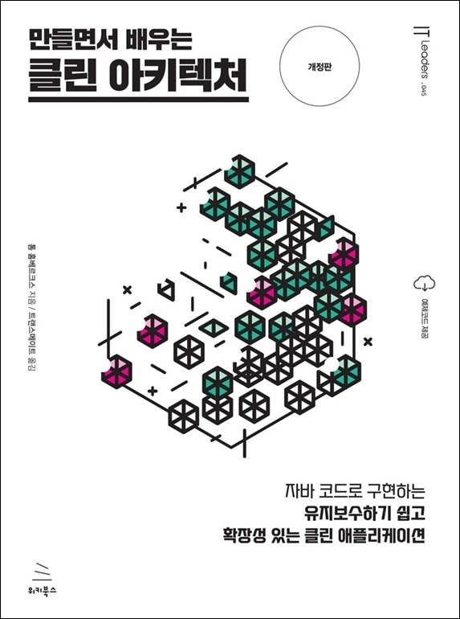

# 만들면서 배우는 클린 아키텍처 (개정판) (ebook)
### 자바 코드로 구현하는 유지보수하기 쉽고 확장성 있는 클린 애플리케이션

- **톰 홈베르크스** 지음 | **트랜스메이트** 옮김
- ISBN: 9791158396909
- 판형: 175\*235\*10mm
- 20,000원 | 2026년 7월 10일 발행 | 197쪽
- [책 홈페이지](https://wikibook.co.kr/clean-architecture-2nd/)
- [도서 미리보기](https://ebook-product.kyobobook.co.kr/dig/preview/E000013260776)
- [도서 관련 문의](https://wikibook.co.kr/support/contact/)

---

**헥사고날 아키텍처가 유지보수성을 높이는 데 어떻게 도움이 될까?**

유지보수성을 고려한 설계는 개발 비용을 낮추고 개발자의 만족도를 높이는 핵심 요소다. 《만들면서 배우는 클린 아키텍처》 개정판은 유지보수성이 뛰어난 소프트웨어를 구축하는 데 필요한 필수 기술과 지식을 알려준다.

이 책에서는 기존 계층형 아키텍처의 단점을 살펴보고, 로버트 C. 마틴의 ‘클린 아키텍처’와 알리스테어 콕번의 ‘헥사고날 아키텍처(Hexagonal Architecture)’ 같은 도메인 중심 아키텍처의 장점을 강조한다. 이어서 육각형 아키텍처를 실제 코드로 구현하는 방법을 보여주는 실습을 진행한다. 또한 육각형 아키텍처의 각 계층 간 다양한 매핑 전략에 대해 자세히 배우고, 아키텍처 요소들을 애플리케이션으로 조립하는 방법을 확인한다. 후반부에서는 아키텍처 경계를 어떻게 강화해야 하는지, 어떤 지름길이 어떤 유형의 기술적 부채를 초래하는지, 그리고 때로는 의도적으로 그러한 부채를 감수하는 것이 어떠한 이유로 적절한 선택인지에 대해 설명한다.

이 책을 읽고 나면 헥사고날 아키텍처에 대한 깊은 이해를 바탕으로 비용과 시간을 절약해 주는 유지보수성이 뛰어난 웹 애플리케이션을 만들 수 있을 것이다. 또한 여러분의 소프트웨어 아키텍처 역량을 새로운 차원으로 끌어올리고, 시간이 지나도 견고하게 동작하는 애플리케이션을 구축할 수 있도록 도와줄 것이다.

**★ 이 책에서 다루는 내용 ★**

- 계층형 아키텍처 사용 시 발생할 수 있는 잠재적 단점
- 아키텍처 경계를 확고히 하기 위한 다양한 방법
- 잠재적인 지름길이 소프트웨어 아키텍처에 미치는 영향
- 다양한 아키텍처 스타일 사용
- 아키텍처에 따른 코드 구조화
- 아키텍처의 각 요소를 확인하기 위한 다양한 테스트 실행 방법

---
 
 ## 구입처
 
 - [리디](https://ridibooks.com/books/1160000249)
 - [예스24](https://www.yes24.com/product/goods/193465995)
 - [알라딘](https://www.aladin.co.kr/shop/wproduct.aspx?ItemId=397919193)
 - [교보문고](https://ebook-product.kyobobook.co.kr/dig/epd/ebook/E000013260776)
